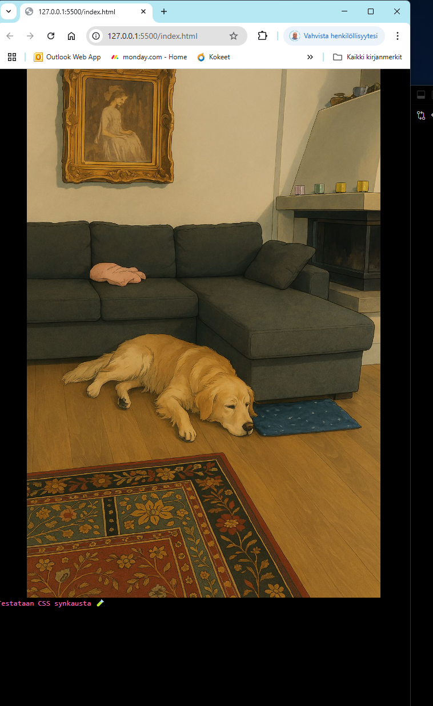

Projektin nimi: The-Golden-Cut-Project – HTML + CSS -toteutus

#Tavoite:
Toteuttaa tehtävänannon mukainen responsiivinen HTML/CSS-sivu,
jossa on kolme kuvaa, tekstejä ja hover-efekti, sekä huolellinen rakenne ja kommentointi.

Toteutusvaiheet:

[ OK ] 1. Rakennettu kansiorakenne (images, styles.css, index.html, README.txt)
[ OK ] 2a. Luotu HTML-runko (header, main, footer) sekä GitHub integrointi VS Code:een.
[ OK ] 2b. Testattu että commit ja push toimivat sekä styles ja html puhuu keskenään sujuvasti.
[ OK ] 2c. HTML- ja CSS-rungot luotu VS Codessa. Boilerplate-toteutus valmis ja `styles.css` yhdistetty `index.html`-tiedostoon (`<link rel="stylesheet" href="styles.css">)
[ Ok ] 2d. Kuvat ja responsiivinen skaalaus (HTML + CSS) 
Projektin images-kansioon lisättiin kuva meidän koirasta (Studio Ghibli-tyyli) (golden.jpg). Kuva upotettiin index.html-tiedostoon img-elementin avulla, ja sille asetettiin saavutettava alt-teksti.
[OK] 3a. Lisätty kolme kuvaa omiin sectioneihin ja kommentoitu
[ ]  3b. Lisätty kuviin hover-efekti (opacity/scale/box-shadow tms.)[ ]
[ ] 4. Lisätty tekstit ja haalea hover-efekti
[ ] 5. Tyylitelty CSS:llä (layout, fontit, värit)
[ ] 6. Responsiivisuus testattu
[ ] 7. Kommentoitu kaikki koodi selkeästi
[ ] 8. Luovutetaan Timo-opettajalle

Tekijä: Markus "NorthFox" Kaprio
Päivämäärä: 4.4.2025

							
			            -Tapahtumaloki- 

   Projektin ensimäinen työvaihe: repo + versiohallinta + yhteistyö

1. Tehdään VS Code:en uusi hakemisto "The Golden Cut of the Golden Retriever" ja luodaan kansiorakenne (index.html,styles.css,images/, README.txt).

2. Tehdään VS Code:een ja GitHub:iin kokonaan uusi (myös VS Code:een integroitu) hakemistorakenne -> Kansio "The golden cut" omalle desktop:lle.

3. Avasin terminaali (CTRL + ö) ja nyt kun on aivan uusi hakemisto se pitää perustaa VS Code:een ja linkittää GitHub:iin tämä -The Cut of the Golden Retriever-hakemisto. 

4.  'git init' alustetaan ensin Git-repo sitten komento-> 'git add .' jolla lisäsin filet versionhallintaan

5.  git commit -m "initial commit", jonka jälkeen luotiin uusi repo mun "ArcticCoderGuy"- GitHub profiiliin

6.Linkitetään paikallinen kansio GitHub:iin: git remote add origin https://github.com/ArcticCoderGuy/the-golden-cut.git -> 'git branch -M main' -> 'git push -u origin main'

7. Tarkistin että GitHub:ssa näkyy kaikki tiedostot: 'git add .' -> git commit -m "Eka muutos readme.txt tiedostoon" -> 'git push' 

8. Testataaan vielä varmuudeksi että commit:oimnti toimii ja toimii varmisti

